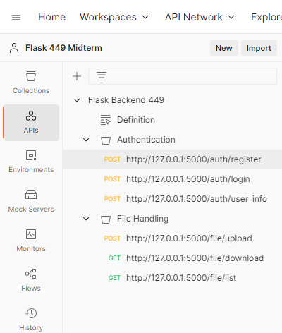

# CPSC449_PROJECT1

## Group 10

- HaYeon SON
- Jimy Bombela
- Matt Watkins

## Installing & Running

```bash
git clone https://github.com/hyson0427/CPSC449_PROJECT1.git
cd CPSC449_PROJECT1
# Edit db_config.py here to match your database settings
git update-index --assume-unchanged db_config.py
# Update git to ignore changes to db_config.py
# (so you don't accidentally commit your password)
python -m venv .venv
source ./venv/bin/activate
# On Windows, use .venv\Scripts\activate.bat instead
pip install -r requirements.txt
flask run
```

## Endpoints

The following endpoints are available:


